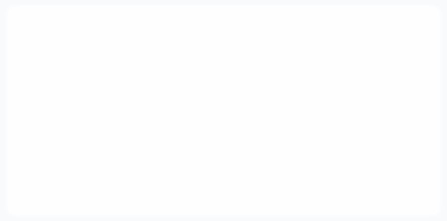

# The Record

> *"If the Database (God) is the atemporal record of all computation, and our thought is the flicker (IS/IS-NOT) that writes to it, what is the color of the ink?"*

An interactive visualization of chaotic attractors — mathematical systems that model deterministic chaos. Watch 10 strange attractors dance through phase-space, each tracing patterns that never repeat yet never escape their bounds. Flip to **Page 2** for ten more systems invented for this project, and **Page 3** for a menagerie of ten different kinds of dynamics — a fractal, a Julia set, ants, a billiard, a double pendulum, gravity, a delay equation, a flock, a quasi-periodic weave, a bouncing ball.



[](https://react.dev)
[](https://www.typescriptlang.org)
[](https://vitejs.dev)
[](https://tailwindcss.com)
[](LICENSE)

> **🤖 Fully generated with Claude Opus 4.5 and Gemini 3.0 — Chat only.**
>
> See [Interactive Attractor Controls.md](Interactive%20Attractor%20Controls.md) for the complete conversation log.

---

## ✨ Features

- **10 Chaotic Attractors** — Lorenz, Rossler, Henon, Chua, Sprott, Four-Wing, Rabinovich, Halvorsen, Dadras, Aizawa
- **Page 2 — 10 Original Attractors** — Sigil, Wick, Cinder, Gyre, Moth, Tidepool, Ossuary, Ripple, Anvil, Reed: systems designed for this project, parameter-swept for bounded chaos with `npm run vet:attractors`
- **Page 3 — The Menagerie** — Thicket (IFS), Dendrite (Julia set), Colony (Langton's ants), Stadium (billiard), Pendulum (double pendulum), Cluster (N-body), Echo (delay equation), Murmuration (boids), Loom (quasi-periodic), Rebound (bouncing ball): ten different classes of dynamics on one grid. Pages switch with the toolbar group or `1` / `2` / `3`
- **Real-time 3D Rendering** — Canvas-based simulation with isometric projection
- **Interactive Per-Tile Controls** (visible on hover / focus):
  - 🕹️ **Joystick Rotation** — Drag to rotate X/Y axes (now with live needle indicator)
  - 🔍 **Scale Slider** — Zoom in/out with live readout
  - ➕➖ **Point Count** — Add or remove simulation points (1–50)
  - ⚡ **Speed Control** — Adjust simulation timestep
  - 🎨 **Color Picker** — Change attractor colors dynamically
  - 🎲 **Randomize** — Instantly randomize color, rotation, scale, and speed
  - 🚿 **Flush** — Clear trail history for a tile
  - ℹ️ **Info Tooltip** — Hover the tile title for equations, Lyapunov exponent, and discoverer
- **Global Toolbar** — Pause, Reset All, 🎲 Randomize All, **Page 1 / 2 / 3 group**, Palette presets, **Perf mode (Low/Med/High)**, PNG export, **WebM recorder with elapsed counter + 60 s soft cap**, Tour, Theme toggle, Stats overlay, Help modal
- **Generative audio synth** — 10 oscillator voices mapped from each attractor (`x → pitch`, `y → pan`, `z → filter cutoff`), default muted, `M` to toggle, ducks on pause
- **Narrative tour with grid spotlight** — opening the Tour dims the other nine tiles so the current attractor stays lit
- **Narrative Tour** — Guided walkthrough of all 10 attractors (toolbar "Tour" or `N`)
- **PNG + WebM Export** — Snapshot the canvas as PNG or record a WebM video
- **6 Palette Presets** — Original, Neon, Pastel, Mono, Warm, Cold — applied to all 10 attractors
- **Dark + Light themes** — CSS-variable-driven, tuned glow/alpha per theme, persisted to `localStorage`, honors `prefers-color-scheme`
- **Keyboard Shortcuts** — `Space` pause, `Esc` reset, `?` help, `S` stats, `T` theme, `R` randomize all, `P` PNG, `V` record, `N` tour, `M` mute, `1`/`2`/`3` page, `+/-` point count on focused tile, arrows rotate focused joystick
- **Touch Support** — Pointer Events across joystick and canvas
- **Responsive Grid** — 2 / 3 / 5 columns across mobile / tablet / desktop
- **Accessibility** — ARIA labels, visible focus rings, keyboard-reachable controls
- **Multi-point Simulation** — Each attractor runs parallel points with coherent color gradients
- **Persistent Grid Trails** — Colored trails fade over time, creating visual memory

## 🚀 Getting Started

```bash
# Clone the repository
git clone https://github.com/stanislavhi/the-record.git
cd the-record

# Install dependencies
npm install

# Start development server
npm run dev
```

Open [http://localhost:5173](http://localhost:5173) in your browser.

```bash
# Build for production
npm run build
npm run preview
```

## 🎮 Usage

1. **Click anywhere** to trigger the merge and start the simulation
2. **Hover over any tile** (or tab to it) to reveal the control panel
3. **Drag the joystick** to rotate the attractor in 3D space — the needle tracks rotation live
4. **Adjust sliders** for scale and speed (values displayed alongside each slider)
5. **Click +/−** to add or remove simulation points
6. **Pick a color** to change the attractor's hue
7. **Click Flush** to clear just that tile's trail history
8. **Use the bottom toolbar or keyboard** for global actions:

### ⌨️ Keyboard shortcuts

| Key | Action |
|-----|--------|
| `Space` | Pause / resume simulation |
| `Esc` | Reset all trails (or close open modal) |
| `?` / `H` | Toggle the keyboard-shortcut help modal |
| `S` | Toggle the stats overlay (FPS / points / energy) |
| `T` | Toggle dark / light theme |
| `R` | Randomize all attractors |
| `P` | Save PNG snapshot of the canvas |
| `V` | Start / stop WebM recording (auto-stops at 60 s) |
| `N` | Open / close the narrative tour |
| `M` | Mute / unmute the generative audio synth |
| `1` / `2` / `3` | Page 1 classics / Page 2 originals / Page 3 menagerie |
| `+` / `-` | Add / remove a point on the last-focused tile |
| `Arrows` | Rotate the last-focused tile's joystick |

## 🧮 The Attractors

### Page 1 — the classics

| Name | Color | Type | Description |
|------|-------|------|-------------|
| **Lorenz** | ⬜ White | Continuous | The butterfly effect, discovered 1963 |
| **Rössler** | 🟡 Gold | Continuous | Simplest chaotic flow |
| **Hénon** | 🩷 Hot Pink | Discrete | 2D map, scattered point cloud |
| **Chua** | 🟠 Orange | Continuous | Double scroll attractor |
| **Sprott** | 🔵 Cyan | Continuous | Minimal 3D chaotic system |
| **Four-Wing** | 🟢 Green | Continuous | Hyperchaotic, 4 lobes |
| **Rabinovich** | 🩵 Mint | Continuous | Fabrikant system |
| **Halvorsen** | 🩷 Magenta | Continuous | Cyclically symmetric |
| **Dadras** | 💜 Violet | Continuous | 5-parameter system |
| **Aizawa** | 🟠 Amber | Continuous | Toroidal shape |

### Page 2 — the originals (Wave 4)

Ten systems invented for The Record. Each is a deliberate twist on a known chaos mechanism; coefficients were chosen by numerical sweep so every one stays bounded and chaotic under the app's own Euler step. Lyapunov exponents in the tooltips are measured, not quoted.

| Name | Color | Type | Mechanism |
|------|-------|------|-----------|
| **Sigil** | 💜 Violet | Continuous | Lorenz with a cos(wz) gain |
| **Wick** | 🟡 Candle | Continuous | Lorenz with a one-sided \|xy\| pump on z |
| **Cinder** | 🔴 Ember | Continuous | Chua with a tanh diode |
| **Gyre** | 🩵 Teal | Continuous | Dadras scrolls + cos(x) ripple |
| **Moth** | 🩷 Rose | Continuous | Jerk-like flow with a y·tanh(y) thermostat |
| **Tidepool** | 🟢 Sea green | Continuous | Rotation whose radius is dialled by z |
| **Ossuary** | 💜 Lilac | Continuous | Nosé–Hoover + sin(wx) forcing |
| **Ripple** | 🔵 Ice | Discrete | 3D sine/cosine map with a delayed echo |
| **Anvil** | ⚪ Steel | Continuous | Jerk: sin(x) kick vs x³ brake |
| **Reed** | 🟢 Chartreuse | Continuous | Jerk with a √\|x\| restoring force |

### Page 3 — the menagerie (Wave 4)

Not attractors — ten different classes of dynamics, each run through the same tile pipeline. Three of them (Cluster, Murmuration, Colony) are interacting systems, so the point-count buttons change the physics.

| Name | Color | Class | What it is |
|------|-------|-------|------------|
| **Thicket** | 🟢 Leaf | IFS | Chaos game on four 3-D affine maps |
| **Dendrite** | 🩷 Magenta | Complex map | Julia set of z² + c by inverse iteration |
| **Colony** | 🟡 Yellow | Cellular automaton | Langton's ants on a shared torus |
| **Stadium** | 🔵 Pale blue | Billiard | Bunimovich stadium, hard reflections |
| **Pendulum** | 🟠 Orange | Hamiltonian | Double pendulum, RK4, no damping |
| **Cluster** | 🔵 Blue | N-body | The tile's points attract each other |
| **Echo** | 🩵 Teal | Delay equation | Mackey–Glass, delay-embedded |
| **Murmuration** | 💜 Lavender | Agents | Boids in a soft box |
| **Loom** | 🟡 Sand | Quasi-periodic | Three irrational frequencies — the non-chaotic control |
| **Rebound** | 🔴 Red | Impact | Ball on a vibrating plate |

```bash
npm run vet:attractors            # re-measure Page 2 (exit 1 if any system is unstable / non-chaotic)
npm run vet:attractors -- all     # all three pages (Page 1 and Page 3 are informational)
```

## 🏗️ Architecture

```
src/
├── components/
│   ├── TheVoid.tsx            # Slim orchestrator — canvas + hooks + handlers
│   ├── AttractorGrid.tsx      # Overlay loop over attractors
│   ├── AttractorTile.tsx      # Per-attractor frame (title + joystick + panel)
│   ├── ControlPanel.tsx       # Physics/Display grouped controls
│   ├── Joystick.tsx           # Pointer-drag rotation + live needle
│   ├── StatsHUD.tsx           # FPS, point count, energy, phase
│   ├── HelpModal.tsx          # Keyboard shortcut legend
│   ├── Toolbar.tsx            # Global pause/reset/randomize/palette/export/tour/theme
│   ├── InfoTooltip.tsx        # Hover card with equations + metadata
│   ├── TourModal.tsx          # Narrative walkthrough of the active page's attractors
│   ├── IntroOverlay.tsx       # "CLICK TO MERGE" with loading dots
│   ├── PausedOverlay.tsx      # Dimmed pause state
│   ├── AudioPanel.tsx         # Volume + mute for the generative synth
│   ├── ErrorBoundary.tsx      # Readable fallback if canvas fails
│   ├── constants.ts           # Page 1 + Page 2 attractor configs + LAYOUT/CANVAS_STYLE/Z_INDEX/KEYBINDINGS/PERF_PRESETS
│   ├── types.ts               # Shared TypeScript interfaces
│   ├── attractors/
│   │   ├── attractorCalculations.ts  # Classic physics + merged calculator map + isDiscrete()
│   │   ├── originalCalculations.ts   # Page 2 — ten original systems
│   │   ├── menagerieCalculations.ts  # Page 3 — ten classes of dynamics (hidden state in WeakMaps)
│   │   ├── calculatorTypes.ts        # Delta / AttractorCalculator / StepContext / DrawStyle
│   │   └── attractorInfo.ts          # Equations, Lyapunov, discoverer metadata (all 30)
│   └── utils/
│       ├── colorUtils.ts      # RGB ↔ HSL conversions
│       └── projection.ts      # 3D → 2D isometric projection
├── hooks/
│   ├── useAnimationFrame.ts   # RAF loop with pause support
│   ├── usePointerDrag.ts      # Pointer Events (touch + mouse)
│   ├── useKeyboardShortcuts.ts
│   ├── useTheme.ts            # localStorage + matchMedia theme
│   ├── useFPS.ts              # Rolling FPS counter
│   ├── useBreakpoint.ts       # Responsive mobile/tablet/desktop
│   ├── useAttractorSynth.ts   # Lifecycle + gesture-gated audio start
│   └── useAttractorWorker.ts  # Lifecycle for the physics Web Worker
├── audio/
│   └── AttractorSynth.ts      # Web Audio graph (10 sine voices + filter LFO + compressor)
├── workers/
│   └── attractorWorker.ts     # Off-thread physics (init / step / setParams / setPointCount)
├── utils/
│   ├── themeTokens.ts         # Canvas-facing theme token bridge
│   ├── palettes.ts            # Color palette presets
│   ├── randomParams.ts        # Randomizer bounds
│   └── exportCanvas.ts        # PNG snapshot + WebM recorder
├── App.tsx                    # ErrorBoundary + TheVoid
└── main.tsx
scripts/
└── vet-attractors.mjs         # Lyapunov / bounds / divergence check for every attractor (esbuild-bundled TS)
```

## 🛠️ Tech Stack

| Layer | Technology |
|-------|-----------|
| UI Framework | React 19 |
| Language | TypeScript 5.9 |
| Build Tool | Vite 7 |
| Styling | Tailwind CSS 4 (CSS-variable theme) |
| Rendering | HTML5 Canvas 2D |
| Input | Pointer Events (mouse + touch) |

## 📚 Documentation

- [Architecture](docs/ARCHITECTURE.md) — System design, data flow, and type definitions
- [Walkthrough](docs/WALKTHROUGH.md) — Detailed feature guide and usage instructions
- [Changelog](docs/CHANGELOG.md) — Complete development history
- [Chat History](Interactive%20Attractor%20Controls.md) — Full AI conversation log

## 📜 Philosophy

This project explores the boundary between determinism and apparent randomness. Chaotic systems are entirely deterministic — given initial conditions, their trajectory is fixed — yet they exhibit sensitivity to initial conditions that makes long-term prediction impossible.

The "ink" we write with is the observer's attention. The "database" is the mathematical phase-space where all possible states exist simultaneously. Our interaction — adjusting parameters, watching trajectories — is the "flicker" that selects which states manifest visually.

---

*Built with curiosity about the nature of computation and chaos.*
